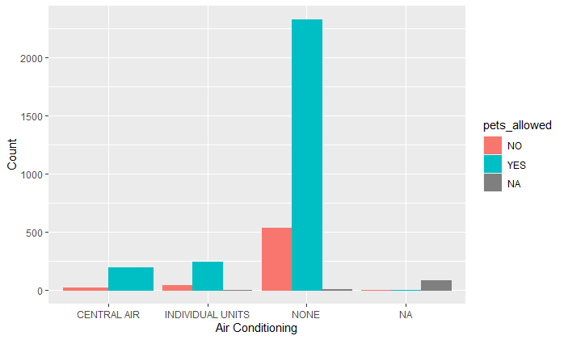
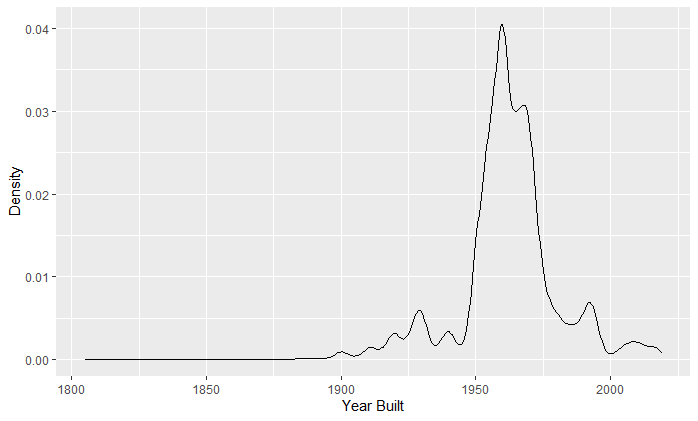

Mini Data Analysis: Milestone 1
================

Completed by Tabitha Kennedy

Student number: 87682746

### Load the required packages for this Milestone:

``` r
library(datateachr)
library(tidyverse)
```

    ## -- Attaching packages --------------------------------------- tidyverse 1.3.1 --

    ## v ggplot2 3.3.5     v purrr   0.3.4
    ## v tibble  3.1.5     v dplyr   1.0.7
    ## v tidyr   1.1.3     v stringr 1.4.0
    ## v readr   2.0.2     v forcats 0.5.1

    ## -- Conflicts ------------------------------------------ tidyverse_conflicts() --
    ## x dplyr::filter() masks stats::filter()
    ## x dplyr::lag()    masks stats::lag()

### Task 1: Choosing my favourite dataset:

### 1.1

Out of the seven datasets available in the datateachr package, I have
chosen four that appeal to me based on their descriptions.

1.  **apt\_buildings**
2.  **building\_permits**
3.  **steam\_games**
4.  **vancouver\_trees**

### 1.2

Let’s view my dataset on apartment buildings in Toronto to see what sort
of data is available to us…

``` r
head(apt_buildings)
```

    ## # A tibble: 6 x 37
    ##      id air_conditioning amenities   balconies barrier_free_acc~ bike_parking   
    ##   <dbl> <chr>            <chr>       <chr>     <chr>             <chr>          
    ## 1 10359 NONE             Outdoor re~ YES       YES               0 indoor parki~
    ## 2 10360 NONE             Outdoor po~ YES       NO                0 indoor parki~
    ## 3 10361 NONE             <NA>        YES       NO                Not Available  
    ## 4 10362 NONE             <NA>        YES       YES               Not Available  
    ## 5 10363 NONE             <NA>        NO        NO                12 indoor park~
    ## 6 10364 NONE             <NA>        NO        NO                Not Available  
    ## # ... with 31 more variables: exterior_fire_escape <chr>, fire_alarm <chr>,
    ## #   garbage_chutes <chr>, heating_type <chr>, intercom <chr>,
    ## #   laundry_room <chr>, locker_or_storage_room <chr>, no_of_elevators <dbl>,
    ## #   parking_type <chr>, pets_allowed <chr>, prop_management_company_name <chr>,
    ## #   property_type <chr>, rsn <dbl>, separate_gas_meters <chr>,
    ## #   separate_hydro_meters <chr>, separate_water_meters <chr>,
    ## #   site_address <chr>, sprinkler_system <chr>, visitor_parking <chr>, ...

Let’s find 3 attributes for each of my datasets…

**apt\_buildings dataset:**

``` r
dim(apt_buildings)
```

    ## [1] 3455   37

``` r
class(apt_buildings$air_conditioning)
```

    ## [1] "character"

**building\_permits dataset:**

``` r
dim(building_permits)
```

    ## [1] 20680    14

``` r
class(building_permits$project_value)
```

    ## [1] "numeric"

**steam\_games dataset:**

``` r
dim(steam_games)
```

    ## [1] 40833    21

``` r
class(steam_games$publisher)
```

    ## [1] "character"

**vancouver\_trees dataset:**

``` r
dim(vancouver_trees)
```

    ## [1] 146611     20

``` r
class(vancouver_trees$species_name)
```

    ## [1] "character"

### 1.3: Narrowing down my choice of datasets to two:

**1. steam\_games**

This dataset looks like it would be fun to explore - I enjoy playing
games and would be interested to see the correlation between genre and
all\_reviews, publisher and original price, recommend\_requirements and
release\_date, etc.

**2. apt\_buildings**

I selected the apt\_buildings dataset as my second choice, as I have
recently moved into my first apartment and am curious to learn of any
correlations between certain apartment amenities (i.e. heating\_type,
laundry\_room, facilities\_available) and size of the building
(i.e. no\_of\_stories) as well as if there is any relation between
apartment safety features and year built or no\_of\_units.

### 1.4: Final decision:

I have decided to go with the **apt\_buildings** dataset, as I was
concerned with the tidiness of the steam\_games dataset. The
steam\_games dataset had columns that were quite messy with too much
information contained (for example, the all\_reviews column contained
information on overall rating score, statistics on the amount of user
reviews, etc.; the popular\_tags and genre columns were also quite broad
and I had trouble deciding how I would like to summarize this data).

I would enjoy working with the apt\_buildings dataset as it contains a
mix of numeric values and character values, and might provide
interesting information regarding compliance with apartment safety
features and property management companies. I would also like to see
whether features that are typically indicative of property age (ie
smoking status, emergency power, window type, number of stories) are in
fact correlated to building age. I would also be curious to see how many
pet-friendly apartments provide air conditioning, as pet safety is
important to me.

### Task 2: Exploring my dataset

### 2.0: Introduction to project:

This .Rmd file is the first in a series of deliverables for STAT 545A’s
Mini Data Analysis Assignment. The goal for the first deliverable in the
Mini Data Analysis Assignment is for students to become familiar with
data analysis techniques using the R programming language. Students
select a dataset of their choosing (for my project, I have selected the
apt\_buildings dataset available through the datateachr package) and
formalize research questions related to their dataset that they wish to
explore in future sections of the assignment. Students also gain
practice in generating tidy and reproducible code through the use of R
Markdown. In the section below, I explore the apt\_buildings dataset
provided courtesy of The City of Toronto’s Open Data Portal using data
analysis techniques taught within STAT 545A.

### 2.0.1: Load libraries:

``` r
library(dplyr)
library(ggplot2)
```

### 2.1: Diving deeper into my data:

### 2.1.1: Plot the distribution of a numeric variable:

I chose to plot the distribution of number of storeys (no\_of\_storeys)
in apartment buildings within Toronto. I was curious to see what the
average height of apartment buildings in Toronto would be. To do this, I
used the geom\_histogram function from the ggplot2 package.

``` r
ggplot(data=apt_buildings, aes(no_of_storeys)) + 
         geom_histogram()+
         ggtitle("Number of Storeys for Toronto Apartment Buildings")+
         xlab("Number of Storeys in Building")+
         ylab("Count")+
         xlim(0, 55)+
         stat_bin(binwidth = 2)
```

    ## `stat_bin()` using `bins = 30`. Pick better value with `binwidth`.

    ## Warning: Removed 2 rows containing missing values (geom_bar).

    ## Warning: Removed 1 rows containing missing values (geom_bar).


### 2.1.2: Create a new variable based on other variables in your data:

Buildings 40 years of age or older may be considered for designation of
national historic significance (Heritage building) according to the
Government of Canada.

I decided to create a new variable named age\_significance where
apartment buildings in Toronto equal to or greater than 40 years old as
of 2021 (i.e. year built equal to or less than 1981) would be classified
as Heritage, and all others would be classified as Modern.

``` r
apt_buildings$age_significance <- 
apt_buildings$age_significance[apt_buildings$year_built<= 1981] <- "Heritage"
```

    ## Warning: Unknown or uninitialised column: `age_significance`.

``` r
apt_buildings$age_significance[apt_buildings$year_built> 1981] <- "Modern"
```

### 2.1.3: Explore the relationship between 2 variables in a plot:

I decided to explore the relationship between air conditioning and pets
being allowed in Toronto apartment buildings. With summer heat waves
becoming more common in Toronto and other large cities in Canada,
reducing the likelihood of heat exhaustion/heat stroke in pets by
providing air conditioning in apartment buildings is a topic of
importance to me.

To do this, I used the geom\_bar function within ggplot2 to create a bar
plot of types of air conditioning in apartment buildings, and broke each
category down by whether they allowed pets in the building, or not.
Because there was a disproportionately large amount of buildings that
did not contain air conditioning (None) compared to buldings that had
either central air or individual unit air conditioning, I may tweak this
analysis in the future to represent ‘pets allowed’ (yes, no, n/a) as
proportions within each category, rather than counts.

``` r
 ggplot(apt_buildings, aes(x = air_conditioning, stat="count")) +
 geom_bar(aes(color=pets_allowed, fill=pets_allowed), position="dodge")+
 xlab("Air Conditioning")+
 ylab("Count")
```


### 2.1.4: Use a density plot to explore any of your variables:

I decided to create a density plot of year\_built to visualize which
decades the majority of apartment buildings in Toronto had been built
in. In the plot below, we can see that a large number of apartments were
constructed between 1950 and 1975.

``` r
ggplot(apt_buildings, aes(year_built))+
  geom_density()+ 
  xlab("Year Built")+
  ylab("Density")
```




### Task 3: Write my research question:

In greater depth, I would like to explore the following research
questions throughout this assignment:

1.  Which property management companies in Toronto provide the greatest
    level of living quality to their tenants? Living quality could be
    defined by the presence or absence of certain amenities such as
    availability of bike parking, car parking, visitor parking, air
    conditioning, no smoking policy, etc. Categorical values such as
    parking type could be reclassified as numerical values on a scale
    (less desirable categories being assigned lower values, while more
    desirable categories being assigned higher values) and scores for
    each variable could be added together to create a final score for
    each property management company.

2.  Is building safety related to building age? This could be explored
    by plotting the relation between year\_built and other variables
    such as exterior\_fire\_escape, fire\_alarm, sprinkler\_system,
    emergency\_power, non\_smoking\_building, etc.

3.  Are certain desirable apartment amenities to me (such as indoor
    recreation room, indoor exercise room, presence of laundry room,
    outdoor rec facilities, units with balconies, underground or ground
    level garage, yes to pets being allowed) more commonly found in
    apartment buildings of larger sizes (i.e. no\_of\_storeys)? Are
    certain amenities found less in apartments with a lower amount of
    storeys?

4.  Which neighborhoods/areas in Toronto contain the greatest amount of
    apartment buildings based on the information contained in this
    dataset? This could be assessed using the ward column and
    quantifying the number of apartments in each ward. It would also be
    interesting to assess whether certain wards have a greater
    percentage of buildings considered to be Modern (based on my
    age\_significance variable), contain more safety features, or
    contain more desirable amenities.

This concludes the first portion of my Mini Data Analysis Assignment for
STAT 545A. Thank you very much for reading through this deliverable! Any
feedback is greatly appreciated. :)
