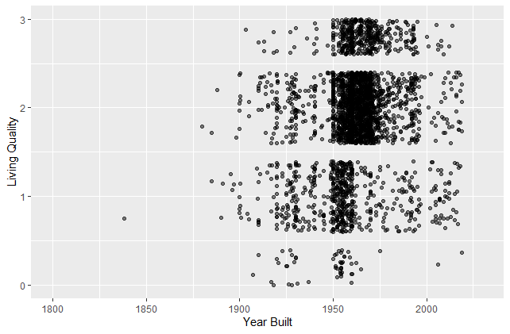
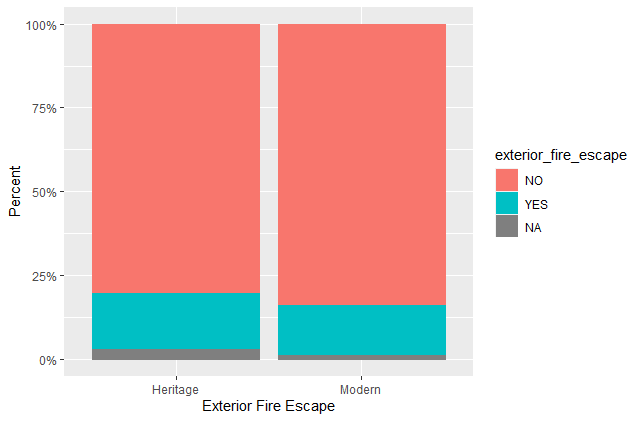
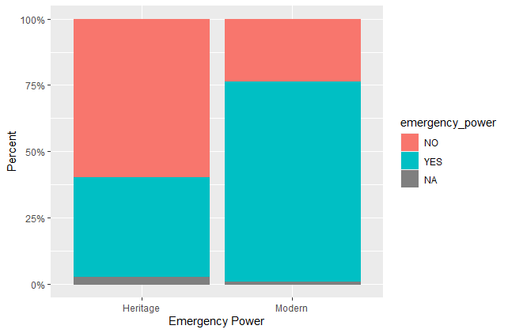
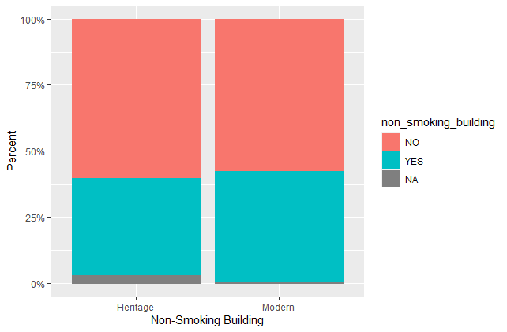
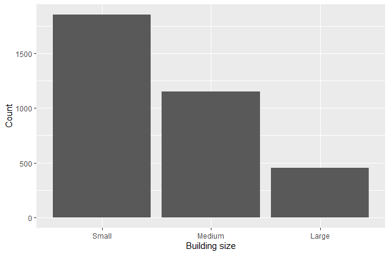
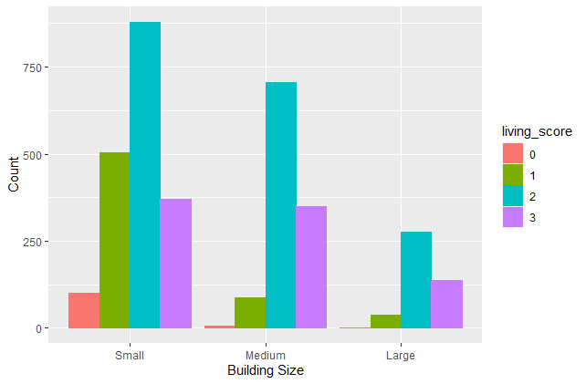
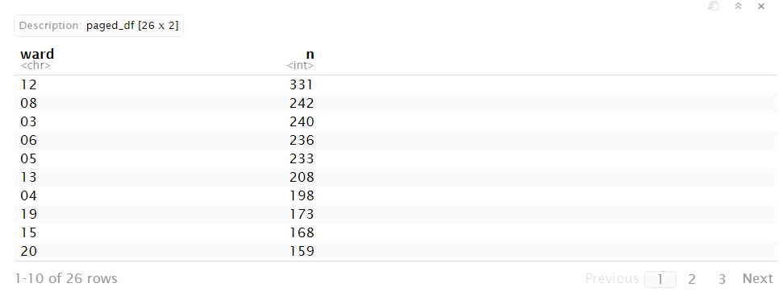
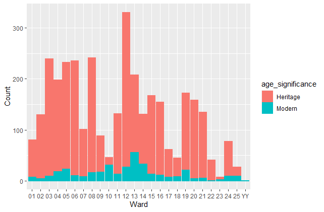

Mini Data Analysis Milestone 2
================

Completed by Tabitha Kennedy

# Welcome back to your mini data analysis project!

This time, we will explore more in depth the concept of *tidy data*, and
hopefully investigate further into your research questions that you
defined in milestone 1.

**NOTE**: The main purpose of the mini data analysis is to integrate
what you learn in class in an analysis. Although each milestone provides
a framework for you to conduct your analysis, it’s possible that you
might find the instructions too rigid for your data set. If this is the
case, you may deviate from the instructions – just make sure you’re
demonstrating a wide range of tools and techniques taught in this class.

Begin by loading your data and the tidyverse package below:

``` r
library(datateachr) # <- might contain the data you picked!
library(tidyverse)
```

# Task 1: Process and summarize your data:

From milestone 1, you should have an idea of the basic structure of your
dataset (e.g. number of rows and columns, class types, etc.). Here, we
will start investigating your data more in-depth using various data
manipulation functions.

### 1.1: Initial Research Questions:

First, write out the 4 research questions you defined in milestone 1
were. This will guide your work through milestone 2:

1.  Which property management companies in Toronto provide the greatest
    level of living quality to their tenants? Living quality could be
    defined by the presence or absence of certain amenities such as
    availability of bike parking, car parking, visitor parking, air
    conditioning, no smoking policy, etc. Categorical values such as
    parking type could be reclassified as numerical values on a scale
    (less desirable categories being assigned lower values, while more
    desirable categories being assigned higher values) and scores for
    each variable could be added together to create a final score for
    each property management company.

2.  Is building safety related to building age? This could be explored
    by plotting the relation between year\_built and other variables
    such as exterior\_fire\_escape, fire\_alarm, sprinkler\_system,
    emergency\_power, non\_smoking\_building, etc.

3.  Are certain desirable apartment amenities to me (such as indoor
    recreation room, indoor exercise room, presence of laundry room,
    outdoor rec facilities, units with balconies, underground or ground
    level garage, yes to pets being allowed) more commonly found in
    apartment buildings of larger sizes (i.e. no\_of\_storeys)? Are
    certain amenities found less in apartments with a lower amount of
    storeys?

4.  Which neighborhoods/areas in Toronto contain the greatest amount of
    apartment buildings based on the information contained in this
    dataset? This could be assessed using the ward column and
    quantifying the number of apartments in each ward. It would also be
    interesting to assess whether certain wards have a greater
    percentage of buildings considered to be Modern (based on my
    age\_significance variable), contain more safety features, or
    contain more desirable amenities.

From the commentary I received from my TA Iciar, some of my research
questions were overly complex for the goal of this assignment (which is
to simply become familiar with writing a reproducible analysis and
exploring data!). As a result, I will be amending some of my research
questions below as I work through them, so that they are within the
scope of this project, and as well to allow me more flexibility in
completing the **Summarizing** and **Graphing** tasks (some of these
tasks proved to be too difficult to incoorporate into my original
research questions).

### 1.2: Summarizing & Graphing Tasks:

Now, for each of your four research questions, choose one task from
options 1-4 (summarizing), and one other task from 4-8 (graphing). You
should have 2 tasks done for each research question (8 total). Make sure
it makes sense to do them! (e.g. don’t use a numerical variables for a
task that needs a categorical variable.). Comment on why each task helps
(or doesn’t!) answer the corresponding research question.

Ensure that the output of each operation is printed!

**Summarizing:**

1.  Compute the *range*, *mean*, and *two other summary statistics* of
    **one numerical variable** across the groups of **one categorical
    variable** from your data.
2.  Compute the number of observations for at least one of your
    categorical variables. Do not use the function `table()`!
3.  Create a categorical variable with 3 or more groups from an existing
    numerical variable. You can use this new variable in the other
    tasks! *An example: age in years into “child, teen, adult, senior”.*
4.  Based on two categorical variables, calculate two summary statistics
    of your choosing.

**Graphing:**

5.  Create a graph out of summarized variables that has at least two
    geom layers.
6.  Create a graph of your choosing, make one of the axes logarithmic,
    and format the axes labels so that they are “pretty” or easier to
    read.
7.  Make a graph where it makes sense to customize the alpha
    transparency.
8.  Create 3 histograms out of summarized variables, with each histogram
    having different sized bins. Pick the “best” one and explain why it
    is the best.

Make sure it’s clear what research question you are doing each operation
for!

### Research Question 1: Living Quality

Let’s create a new column where smoking policy is assigned a binary
value (0 or 1) based on whether the building is a non-smoking building
(Yes, 1) or allows smoking (No, 0).

We need to rename the column “non-smoking\_building” so that it can be
computed in R.

``` r
names(apt_buildings)[names(apt_buildings) == "non-smoking_building"] <- "non_smoking_building"

apt_buildings$smoking_score <- ifelse(apt_buildings$non_smoking_building=="YES",1,0)
```

We will do the same for our second measurement of living quality,
balcony (Yes, 1; No, 0), and third measurement of living quality,
laundry room (Yes, 1; No, 0).

``` r
apt_buildings$balcony_score <- ifelse(apt_buildings$balconies=="YES",1,0)

apt_buildings$laundry_score <- ifelse(apt_buildings$laundry_room=="YES",1,0)
```

Next, we will create a new column that adds the binary value from each
of the 3 columns together, to create an overall living score ranging
from 0 to 3 (0 for buildings containing none of the three categories,
and 3 for buildings containing all three categories).

``` r
apt_buildings <- apt_buildings %>% rowwise() %>%
  mutate(living_score = sum(smoking_score, balcony_score, laundry_score, na.rm = TRUE))
```

Now, let’s create a scatterplot of year built vs living quality score.
We will use alpha transparency to visualize where points on our graph
are more condensed.

``` r
ggplot(apt_buildings, aes(year_built, living_score)) +
   geom_jitter(alpha = 0.5, width=0.2)+
  xlim(1800,2030) +
  xlab("Year Built")+
  ylab("Living Quality")+
  ylim(0,3)
```

    ## Warning: Removed 477 rows containing missing values (geom_point).



From the plot above, it appears that the years 1950 to 1975 contained
the most apartments with a living quality score of 2 or 3. For a living
quality score of 1, apartments tended to be more concentrated between
the years 1950 to 1960. A living quality score of 0 appeared to contain
a rather small subset of data, indicating that the majority of
apartments in Toronto have at least one of my three desired traits for
living quality. Of the apartments which had a living quality score of 0,
most appeared to have been built prior to 1960.The high density of
apartments with living quality scores of 2 or higher between 1950 to
1975 is likely the result of the majority of the apartment buildings in
this dataset having been built between 1950 and 1975, as seen in my work
for Milestone 1 where I created a plot of year\_built against density.
This scatterplot therefore does not provide evidence for a relation
between year built and living quality, as there is a surplus of data
points for apartments built between 1950-1975 and a lack of data points
for apartments built in decades prior to 1950 or post 1975. Our graphing
does reveal, however, that almost no apartments built between 1975 and
2000 contain a living quality score of 0; thus, finding an apartment
built between 1975-2000 would be almost certain to satisfy at least one
of my three living quality components.

### Research Question 2: Building Safety vs Age

Below, I brought back the code I used in Milestone 1 to create a
categorical variable with 2 new groups: Heritage and Modern apartment
building.

I then created a plot of age significance vs exterior fire escape.

``` r
apt_buildings$age_significance <- 
apt_buildings$age_significance[apt_buildings$year_built<= 1981] <- "Heritage"
```

    ## Warning: Unknown or uninitialised column: `age_significance`.

``` r
apt_buildings$age_significance[apt_buildings$year_built> 1981] <- "Modern"


ggplot(apt_buildings, aes(x = age_significance, stat="count")) +
 geom_bar(aes(color=exterior_fire_escape, fill=exterior_fire_escape), position="fill")+
 xlab("Exterior Fire Escape")+
 ylab("Percent")+
 scale_y_continuous(labels = scales::percent)
```



From the plot above, we can see that both Heritage and Modern apartment
buildings tend to lack an exterior fire escape. Comparing across
groupings, there is not much difference between Heritage and Modern
apartment buildings in this area.

Next, we will plot age significance vs emergency power and show in a bar
plot.

``` r
 ggplot(apt_buildings, aes(x = age_significance, stat="count")) +
 geom_bar(aes(color=emergency_power, fill=emergency_power), position="fill")+
 xlab("Emergency Power")+
  ylab("Percent")+
 scale_y_continuous(labels = scales::percent)
```



From the plot above, we can see that having emergency power is less
common in Heritage apartment buildings than it is within Modern
apartment buildings. Heritage apartment buildings are less likely to
come with emergency power.

Finally, we will plot age significance vs non smoking building and show
in a bar plot.

``` r
 ggplot(apt_buildings, aes(x = age_significance, stat="count")) +
 geom_bar(aes(color=non_smoking_building, fill=non_smoking_building), position="fill")+
 xlab("Non-Smoking Building")+
 ylab("Percent")+
 scale_y_continuous(labels = scales::percent)
```



From the plot above, it appears that both Heritage and Modern apartment
buildings have more buildings that are smoking-friendly than
non-smoking. Comparing across groupings, there is not much difference
between Heritage and Modern apartment buildings in this area.

### Research Question 3: Larger Apartment = More Desirable?

Create a categorical variable with 3 or more groups from an existing
numerical variable.

I created a new categorical variable “building size” with 3 groups from
an existing numerical variable (no\_of\_units). The 3 groups were as
follows: Small, Medium, and Large.

I considered Small sized apartment buildings to be those containing less
than 60 units. I considered Medium sized apartment buildings to contain
between 60 and 200 units. I considered Large sized apartment buildings
to be those containing more than 200 units.

``` r
apt_buildings <- apt_buildings %>% 
   mutate(building_size = case_when(no_of_units < 60 ~ "Small",
                                 no_of_units < 200 ~ "Medium",
                                 TRUE ~ "Large"))

apt_buildings$building_size <- factor(apt_buildings$building_size, levels = c("Small", "Medium",                                                           "Large"), ordered = TRUE)

 ggplot(apt_buildings, aes(x = building_size, stat="count")) +
 geom_bar(position="dodge")+
 xlab("Building size")+
 ylab("Count")
```



From the plot above, we can see that the majority of apartment buildings
in Toronto are considered to be small in size.

Let’s now see if there is any trend between the size of an apartment
building and my desired amenities, which I calculated earlier as the
variable living\_score.

We need to make living\_score a categorical variable.

``` r
apt_buildings$living_score <- as.character(apt_buildings$living_score)

 ggplot(apt_buildings, aes(x = building_size, stat="count")) +
 geom_bar(aes(color=living_score, fill=living_score), position="dodge")+
 xlab("Building Size")+
 ylab("Count")
```



From the plot above, we can see that small apartment buildings contain
the vast majority of apartments in Toronto with living scores of 0. This
makes sense, as smaller buildings tend to be older, and thus less likely
to be equipped with amenities that are more desirable in modern society,
such as on-site laundry rooms, non-smoking policy, and private balconies
for tenants. Most buildings with a living quality score of 3 were either
categorized as small or medium. A living quality score of 1 and 2 was
most commonly found in small apartments. It is also interesting to note
that the ratio of living quality score 1 to living quality score 3 is
higher in small apartment buildings, compared to medium and large
apartment buildings where the ratio was lower (i.e. medium and large
apartment buildings had less living quality 1 buildings within their
grouping compared to buildings at living quality 2 and 3). Thus, if you
were looking at listings for medium and large sized apartment buildings,
you would be less likely to come across listing that fell within the 0
or 1 score of living quality compared to if you were viewing listings
for small sized apartment buildings.

### Research Question 4: Which Neighborhoods have the Most Apartments?

I decided to compute the number of observations (i.e. number of
apartment buildings) in each ward (a categorical variable).

``` r
#note: I used the following function below, but it would not knit into a .md file.
#apt_buildings %>% count(ward, sort = TRUE) %>% rmarkdown::paged_table()
```



We can see that ward 12 contains the most apartment buildings out of all
26 wards in Toronto. Ward 12 contains 331 apartment buildings! The ward
with the lowest number of apartment buildings was ward YY, while ward 23
contains the second lowest number of apartment buildings.

Next, I decided to create a bar plot of wards in Toronto to visualize
which wards contained the most apartment buildings. I also added a
colour and fill aesthetic for Age Significance (Heritage or Modern) to
my bar plot to visualize the distribution of building age across the
wards. It appears that the majority of Modern apartment buildings are
located in wards 10, 12, 13, and 14. It also appears that ward 12
contains the largest amount of Heritage apartment buildings, while wards
23 and YY contained the smallest amount of Heritage apartment buildings.

``` r
ggplot(apt_buildings, aes(x = ward, stat="count"))+
 geom_bar(aes(color=age_significance, fill=age_significance))+
 xlab("Ward")+
 ylab("Count")
```



### 1.3: Progress in Answering Research Questions:

Based on the operations that you’ve completed, how much closer are you
to answering your research questions? Think about what aspects of your
research questions remain unclear. Can your research questions be
refined, now that you’ve investigated your data a bit more? Which
research questions are yielding interesting results?

Based on the operations I completed, I am somewhat closer to answering
the research questions I created in Milestone 1. Some research questions
required modification as my questions were either too ambitious for the
scope of this assignment, or we difficult to incorporate within the
requirements of Milestone 2 (ensuring that Sumarizing and Graphing tasks
could be applied within my research questions). Due to my dataset
containing many categorical variables rather than numeric variables, it
was at times difficult to create scatter plots or density plots for my
dataset.

It remains unclear whether there is a relation between year built and
living quality. Perhaps to solve this, I could take the average living
quality score for each year, to reduce repeat variables within my
dataset. Thus, each year would have only one living quality score, and
this revised dataset could be plotted (however, if you, the TA, have a
better suggestion for how to analyze and plot this relation, this would
be much appreciated!).

It is interesting to see the relation between building safety and
building age; where fire escapes are uncommon in both Heritage and
Modern apartment buildings, emergency power is more common in Modern
apartment buildings than Heritage, and non-smoking buildings are roughly
equally as uncommon in Heritage apartment buildings as it is in Modern
apartment buildings.

# Task 2: Tidy your data

In this task, we will do several exercises to reshape our data. The goal
here is to understand how to do this reshaping with the `tidyr` package.

A reminder of the definition of *tidy* data:

-   Each row is an **observation**
-   Each column is a **variable**
-   Each cell is a **value**

*Tidy’ing* data is sometimes necessary because it can simplify
computation. Other times it can be nice to organize data so that it can
be easier to understand when read manually.

### 2.1: Is my Dataset Tidy?

Based on the definition above, can you identify if your data is tidy or
untidy? Go through all your columns, or if you have &gt;8 variables,
just pick 8, and explain whether the data is untidy or tidy.

Below are the 8 variables I have decided to review to determine whether
my dataset is tidy or not:

**amenities** and **parking type** are not tidy variables, as there are
multiple values within a cell.

**balconies**, **exterior fire escape**, **fire alarm**, **laundry
room**, **parking type**, **pets allowed**, and **cooling room** are
tidy variables, as each cell has one value, each row is an observation,
and the column examines a singular variable.

### 2.2: Tidying Data:

Because parts of my data are untidy, I will demonstrate how to tidy my
dataset.

Below, I used the cSplit function from the splitstackshape package to
reformat the amenities column, so that amenity features were shown in my
dataset as separate entries, rather than being input as one long stream
of entries in a cell separated by a comma. Although this makes my
dataset longer, with repeat entries for the same apartment building id,
it makes it easier to work with the amenities data now.

``` r
library(splitstackshape)

apt_buildings3 <- cSplit(apt_buildings, "amenities", ",", direction= "long")
```

    ## Warning in type.convert.default(unlist(x, use.names = FALSE)): 'as.is' should be
    ## specified by the caller; using TRUE

We can see how the amenities column was organized before in the heading
below:

``` r
head(apt_buildings$amenities, 10)
```

    ##  [1] "Outdoor rec facilities"                                     
    ##  [2] "Outdoor pool"                                               
    ##  [3] NA                                                           
    ##  [4] NA                                                           
    ##  [5] NA                                                           
    ##  [6] NA                                                           
    ##  [7] NA                                                           
    ##  [8] "Indoor pool , Indoor recreation room , Indoor exercise room"
    ##  [9] NA                                                           
    ## [10] "Indoor recreation room"

After tidying the data, the amenities column now looks like this:

``` r
head(apt_buildings3$amenities, 10)
```

    ##  [1] "Outdoor rec facilities" "Outdoor pool"           NA                      
    ##  [4] NA                       NA                       NA                      
    ##  [7] NA                       "Indoor pool"            "Indoor recreation room"
    ## [10] "Indoor exercise room"

We could even further tidy this dataset by having each amenity contained
as its own variable (i.e. a column for Sauna, with values as YES or NO).

Let’s do the same thing for the parking type variable.

``` r
apt_buildings3 <- cSplit(apt_buildings, "parking_type", ",", direction= "long")
```

    ## Warning in type.convert.default(unlist(x, use.names = FALSE)): 'as.is' should be
    ## specified by the caller; using TRUE

We can see how the parking type column was organized before in the
heading below:

``` r
head(apt_buildings$parking_type, 10)
```

    ##  [1] "Underground Garage , Garage accessible thru buildg"                  
    ##  [2] "Underground Garage , Garage accessible thru buildg , Surface Parking"
    ##  [3] "Underground Garage , Garage accessible thru buildg , Surface Parking"
    ##  [4] "Ground Level Garage , Surface Parking"                               
    ##  [5] "Underground Garage , Garage accessible thru buildg , Surface Parking"
    ##  [6] "Ground Level Garage , Surface Parking"                               
    ##  [7] "Surface Parking"                                                     
    ##  [8] "Underground Garage , Garage accessible thru buildg , Surface Parking"
    ##  [9] "Underground Garage , Garage accessible thru buildg"                  
    ## [10] "Surface Parking"

After tidying the data, the amenities column now looks like this:

``` r
head(apt_buildings3$parking_type, 10)
```

    ##  [1] "Underground Garage"            "Garage accessible thru buildg"
    ##  [3] "Underground Garage"            "Garage accessible thru buildg"
    ##  [5] "Surface Parking"               "Underground Garage"           
    ##  [7] "Garage accessible thru buildg" "Surface Parking"              
    ##  [9] "Ground Level Garage"           "Surface Parking"

### 2.3: Pick 2 Research Questions to Continue in Milestone 3:

The two research questions I will pursue in Milestone 3 are the
following:

**Research Question 1: Living Quality** I chose this research question,
as I would like to expand the categories for living quality a bit
further by adding a few more variables (i.e. pets\_allowed,
visitor\_parking, window\_type, and whether an apartment building has an
indoor recreation room amenity). I think this will also help create more
significant results if the range of values for living quality scores is
greater. Once I identify which apartment buildings have the highest
living quality scores, I could use a summary function to determine which
ward and which property management company these apartment buildings
fall under.

**Research Question 2: Building Safety vs Age** I would like to explore
building safety further by creating different constraints for age
(i.e. instead of just Heritage vs Modern, classifying buildings based on
decade built (1960, 1970, 1980, etc.) and reporting building safety as a
proportion or percent (i.e. 70% of buildings built in 1970 have
emergency power, 30% do not; 40% of buildings built in 1950 have
emergency power, 60% do not) rather than as a count.

*When you are done, knit an `md` file. This is what we will mark! Make
sure to open it and check that everything has knitted correctly before
submitting your tagged release.*

### Attribution

Thanks to Victor Yuan for mostly putting this together.
