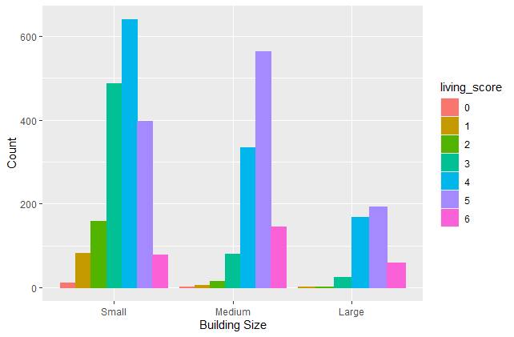
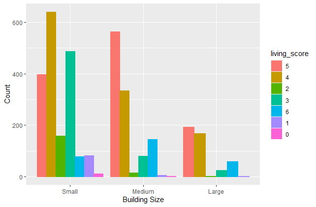
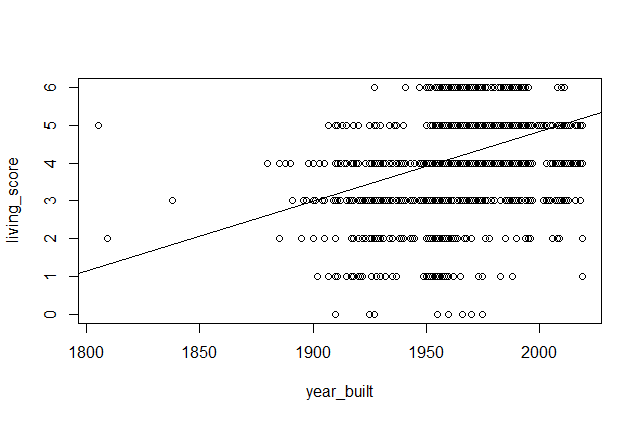

Mini Data-Analysis Deliverable 3
================

Completed by Tabitha Kennedy

# Welcome to your last milestone in your mini data analysis project!

In this (3rd) milestone, you’ll be sharpening some of the results you
obtained from your previous milestone by:

-   Manipulating special data types in R: factors and/or dates and
    times.
-   Fitting a model object to your data, and extract a result.
-   Reading and writing data as separate files.

# Setup

Begin by loading your data and the tidyverse package below:

``` r
library(datateachr) # <- might contain the data you picked!
library(tidyverse)
library(forcats)
library(ggplot2)
```

From Milestone 2, you chose two research questions. What were they? Put
them here.

<!-------------------------- Start your work below ---------------------------->

1.  Living Quality

I chose this research question, as I would like to expand the categories
for living quality a bit further by adding a few more variables
(i.e. pets\_allowed, visitor\_parking, window\_type). I think this will
also help create more significant results if the range of values for
living quality scores is greater. Once I identify which apartment
buildings have the highest living quality scores, I could use a summary
function to determine which ward these apartment buildings fall under.

2.  Building Safety vs Age

I would like to explore building safety further by creating different
constraints for age (i.e. instead of just Heritage vs Modern,
classifying buildings based on decade built (1960, 1970, 1980, etc.) and
reporting building safety as a proportion or percent (i.e. 70% of
buildings built in 1970 have emergency power, 30% do not; 40% of
buildings built in 1950 have emergency power, 60% do not) rather than as
a count.

However, for the purpose of completing the tasks in Milestone 3, I will
focus on my main research question of interest - Living Quality - and
how it relates to multiple variables, such as building age, building
size, ward, etc.

# Exercise 1: Special Data Types:

For this exercise, you’ll be choosing two of the three tasks below –
both tasks that you choose are worth 5 points each.

But first, tasks 1 and 2 below ask you to modify a plot you made in a
previous milestone. The plot you choose should involve plotting across
at least three groups (whether by facetting, or using an aesthetic like
colour). Place this plot below (you’re allowed to modify the plot if
you’d like). If you don’t have such a plot, you’ll need to make one.
Place the code for your plot below.

<!-------------------------- Start your work below ---------------------------->

First, let’s recreate the score columns for non\_smoking\_building,
balcony, and laundry that I made in Milestone 2…

``` r
names(apt_buildings)[names(apt_buildings) == "non-smoking_building"] <- "non_smoking_building"

apt_buildings$smoking_score <- ifelse(apt_buildings$non_smoking_building=="YES",1,0)

apt_buildings$balcony_score <- ifelse(apt_buildings$balconies=="YES",1,0)

apt_buildings$laundry_score <- ifelse(apt_buildings$laundry_room=="YES",1,0)
```

Since my living quality score from Milestone 2 was not quite detailed
enough, let’s add a few more variables such as pets\_allowed (with YES =
1, NO = 0), visitor parking (with PAID = 0, FREE = 1, BOTH = 1,
UNAVAILABLE = 0), and window type (DOUBLE PANE = 1, SINGLE PANE = 0,
THERMAL = 1).

``` r
apt_buildings$pets_score <- ifelse(apt_buildings$pets_allowed=="YES",1,0)

apt_buildings$visitor_parking_score <- ifelse(apt_buildings$visitor_parking %in%        
                                                c("FREE","BOTH"),1,0)

apt_buildings$window_score <- ifelse(apt_buildings$window_type %in% 
                                       c("DOUBLE PANE","THERMAL"),1,0)
```

Next, we will create a new column that adds the binary value from each
of the 6 columns together, to create an overall living score ranging
from 0 to 6 (0 for buildings containing none of the six categories, and
6 for buildings containing all six categories).

``` r
apt_buildings <- apt_buildings %>% rowwise() %>%
  mutate(living_score = sum(smoking_score, balcony_score, laundry_score,
                            pets_score, visitor_parking_score, window_score, na.rm = TRUE))
```

Now that we have successfully recreated our living\_score variable,
let’s continue with recreating my plot from Milestone 2…

``` r
apt_buildings$age_significance <- 
apt_buildings$age_significance[apt_buildings$year_built<= 1981] <- "Heritage"
```

    ## Warning: Unknown or uninitialised column: `age_significance`.

``` r
apt_buildings$age_significance[apt_buildings$year_built> 1981] <- "Modern"

apt_buildings <- apt_buildings %>% 
   mutate(building_size = case_when(no_of_units < 60 ~ "Small",
                                 no_of_units < 200 ~ "Medium",
                                 TRUE ~ "Large"))

apt_buildings$building_size <- factor(apt_buildings$building_size, levels = c("Small", "Medium",                                                           "Large"), ordered = TRUE)

apt_buildings$living_score <- as.character(apt_buildings$living_score)

  ggplot(apt_buildings, aes(x = building_size, stat="count")) +
 geom_bar(aes(color=living_score, fill=living_score), position="dodge") +
 xlab("Building Size") +
 ylab("Count")
```



Now, choose two of the following tasks:

**Task 1:** I produced a new plot that reorders the living score factor
from my original plot, using the forcats package. I used the function
fct\_infreq to reorder living quality score by the freqeuncy of values.
I assumed that ordering living quality scores by frequency would add
additional useful information to my plot for the viewer.

``` r
apt_buildings_2 <- apt_buildings %>%
  mutate(living_score = fct_infreq(living_score))

  ggplot(apt_buildings_2, aes(x = building_size, stat="count")) +
 geom_bar(aes(color=living_score, fill=living_score), position="dodge") +
 xlab("Building Size") +
 ylab("Count")
```



We can see from the plot above that living quality score 5 was the most
frequent score in our dataset, and that living quality score 0 was the
least frequent score. However, ordering our living quality scores by
frequency does not add much value to our data visualization, and in fact
makes the plot more messy. Have living quality scores out of numerical
order is difficult to interpret, and therefore not recommended.

**Task 2:** Produce a new plot that groups some factor levels together
into an “other” category (or something similar), using the `forcats`
package (3 points). Then, in a sentence or two, briefly explain why you
chose this grouping (1 point here for demonstrating understanding of the
grouping, and 1 point for demonstrating some justification for the
grouping, which could be subtle or speculative.)

``` r
#apt_buildings %>%
#mutate(building_size = fct_collapse(living_score,
                    #  "Greater than 3" = c("6", "5","4"),
                    #  "Less than 3" = c("3", "2", "1", "0")))

 # ggplot(apt_buildings, aes(x = building_size, stat="count")) +
 # geom_bar(aes(color=living_score, fill=living_score), position="dodge") +
 # xlab("Building Size") +
 # ylab("Count")
```

Unfortunately, I could not figure out how to apply the forcats function
fct\_collapse to my dataset (please see above for my rough work). I
wanted to group living quality scores 0-3 in a category called Less than
3, and group living quality scores 4-6 in a category called Greater than
3. The intention of this grouping was to see the relation between low
living quality scores and high living quality scores across the range of
building sizes (Small, Medium, and Large) to determine if living quality
score might vary with building size.

# Exercise 2: Modelling:

## 2.0: Picking a Variable of Interest:

Pick a research question, and pick a variable of interest (we’ll call it
“Y”) that’s relevant to the research question. Indicate these.

**Research Question**: Does living quality increase with year built?

**Variable of interest**: living quality (y variable)

## 2.1 Fitting a Model:

I am interested to see whether there is a relation between living
quality score and year built.

Let’s create our linear model:

``` r
a <- lm(living_score ~ year_built, apt_buildings)
print(a)
```

    ## 
    ## Call:
    ## lm(formula = living_score ~ year_built, data = apt_buildings)
    ## 
    ## Coefficients:
    ## (Intercept)   year_built  
    ##   -32.17062      0.01851

``` r
plot(living_score ~ year_built, apt_buildings)
abline(a)
```



As seen in the plot above, there appears to be a positive relationship
between living\_score and year\_built (although we cannot tell how well
the fitted line captures the data with a plot alone).

## 2.2: Anova Tables and Broom Function:

Produce something relevant from your fitted model: either predictions on
Y, or a single value like a regression coefficient or a p-value.

Let’s use the anova() function to look at the significance of our
regression:

``` r
anovatable <- anova(a)
print(anovatable)
```

    ## Analysis of Variance Table
    ## 
    ## Response: living_score
    ##              Df Sum Sq Mean Sq F value    Pr(>F)    
    ## year_built    1  429.2  429.16  370.39 < 2.2e-16 ***
    ## Residuals  3440 3985.8    1.16                      
    ## ---
    ## Signif. codes:  0 '***' 0.001 '**' 0.01 '*' 0.05 '.' 0.1 ' ' 1

From the anova table, we can see that the p-value for year\_built is
2.2e-16, which is very small (less than 0.05). Thus, we can conclude
that there is a significant positive relation between living\_score and
year\_built.

Let’s now use the broom function to produce a tidy tibble.

``` r
tidyanova <- broom::tidy(a)
print(tidyanova)
```

    ## # A tibble: 2 x 5
    ##   term        estimate std.error statistic  p.value
    ##   <chr>          <dbl>     <dbl>     <dbl>    <dbl>
    ## 1 (Intercept) -32.2     1.89         -17.0 1.24e-62
    ## 2 year_built    0.0185  0.000962      19.2 1.78e-78

# Exercise 3: Reading and writing data:

## 3.1: Summary Tables, CSV Files, and here::here Function:

If I was trying to decide which ward to search for apartments in based
on my living quality score criteria, it would be helpful to know the
number of apartment units per living quality score for each unique ward
(under the hypothetical assumption that all units listed in our dataset
are currently available to rent). From this list, I could determine
which ward had the highest count of apartment units with a score of 6
(which happens to be ward 13, with 3646 units available with a living
score of 6).

Let’s create a summary table of mean no\_of\_units for each ward in
Toronto by using the aggregate function.

``` r
abundance <- aggregate(apt_buildings[, 33], list(apt_buildings$ward, apt_buildings$living_score), FUN = sum)

head(abundance)
```

    ##   Group.1 Group.2 no_of_units
    ## 1      04       0          34
    ## 2      07       0          40
    ## 3      09       0          16
    ## 4      10       0           0
    ## 5      11       0          36
    ## 6      12       0         190

Now let’s write this summary table as a csv file:

``` r
here::here("output")
```

    ## [1] "C:/Users/tabit/OneDrive/Pictures/(1) UBC/FALL 2021/(STAT 545A)/Mini Data Analysis/Mini_Data_Analysis/output"

``` r
write.csv(abundance,here::here("output", "Living_Score_and_Units_Per_Ward.csv"))

#path <- here::here("output")
#write.csv(abundance,paste(path,'my_file.csv',sep = ''))
```

## 3.2: saveRDS and readDRS Functions:

Next, let’s write our model object from Exercise 2 to an R binary file
(an RDS), and load it again, making sure to save the binary file in our
`output` folder.

``` r
saveRDS(tidyanova, here::here("output", "model_object_2.rds"))
readRDS(here::here("output", "model_object_2.rds"))
```

    ## # A tibble: 2 x 5
    ##   term        estimate std.error statistic  p.value
    ##   <chr>          <dbl>     <dbl>     <dbl>    <dbl>
    ## 1 (Intercept) -32.2     1.89         -17.0 1.24e-62
    ## 2 year_built    0.0185  0.000962      19.2 1.78e-78

# End of Milestone

Thank you very much for reading through my Milestone work :) I sincerely
appreciate any feedback.
